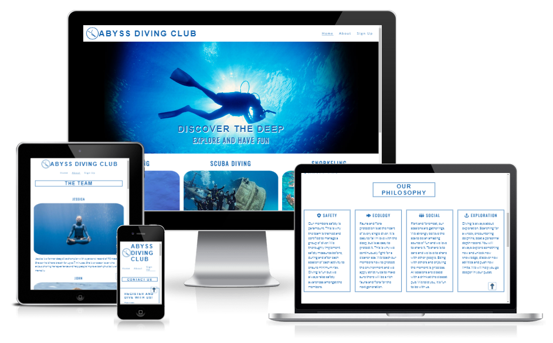

# Abyss-diving-club

[Click here to access live project](https://ludovicleguen.github.io/Abyss-Dive-Club/)
## Table of contents
1. [Introduction](#Introduction)
2. [UX](#UX)
    1. [Ideal User Demographic](#Ideal-User-Demographic)
    2. [User Stories](#User-Stories)
    3. [Development Planes](#Development-Planes)
    4. [Design](#Design)
3. [Features](#Features)
    1. [Design Features](#Design-Features) 
    2. [Existing Features](#Existing-Features)
    3. [Features to Implement in the future](#Features-to-Implement-in-the-future)
4. [Issues and Bugs](#Issues-and-Bugs)
5. [Technologies Used](#Technologies-Used)
     1. [Main Languages Used](#Main-Languages-Used)
     3. [Frameworks, Libraries & Programs Used](#Frameworks,-Libraries-&-Programs-Used)
6. [Testing](#Testing)
     1. [Testing.md](TESTING.md)
7. [Deployment](#Deployment)
     1. [Deploying on GitHub Pages](#Deploying-on-GitHub-Pages)
8. [Credits](#Credits)
     1. [Content](#Content)
     2. [Media](#Media)
     3. [Code](#Code)
9. [Acknowledgements](#Acknowledgements)
***

## Introduction
The website is meant to provide useful information about a fictional diving club located in the Cannes bay, on the French Riviera coast. The club is purely meant to gather people and has no lucrative mean.

As such the target audience is the local population and also the tourists who wants to enjoy a fun activity with other people.

This website is the first Milestone projects (out of five) required to obtain the Diploma in Software development at The Code Institute.

The requirements of this project are:
* Build a responsive and static front-end site 
* Present useful information to users 
* Use HTML5 and CSS3. 
* The site must contain at least three pages.

## UX
### Ideal User Demographic
There are two types of ideal users:
* Frequent user
* New user

### User-Stories
#### Frequent User Goals
* As a frequent user, I want to see a pleasing website representing a group of people to which I am proud to be part of.
* As a current user, I want a website easy to navigate with information easily readable and accessible.
* As a current user, I want to access the content with minimum clicks.

#### New User Goals
* As a new user, I want to navigate the site easily and intuitively.
* As a new user, I want relevant information organized in graphically logical manner.
* As a new user, I want to understand what the website is about within a few seconds.

### Development-Planes
#### Strategy
#### Scope
#### Structure
#### Skeleton

### Design
#### Colour Scheme
#### Typography
#### Imagery

## Features
### Design Features
### Existing Features
### Features to Implement in the future

## Issues and Bugs 

## Technologies Used
### Main Languages Used
### Frameworks, Libraries & Programs Used

## Testing

## Deployment
The site was developped on Gitpod, commiting and pushing to github.

### Deploying on GitHub Pages
To deploy this page to GitHub Pages from its GitHub repository, the following steps were taken:

1. Log into GitHub (or create an account if necessary).
2. Choose the GitHub Repository.
3. Select Settings from the menu items.
4. Select "Pages" from the left hand menu.
5. Under "Branch" click the drop-down menu labelled "None" and select "Main".
6. Click "Save".
7. Wait a few seconds up to a few minutes and refresh the page.
8. The site is now deployed and a link is provided.
    
## Credits 
### Media
### Code 

## Acknowledgements

***
