# Abyss-diving-club

[Click here to access live project](https://ludovicleguen.github.io/Abyss-Dive-Club/)
## Table of contents
1. [Introduction](#Introduction)
2. [UX](#UX)
    1. [Ideal User Demographic](#Ideal-User-Demographic)
    2. [User Stories](#User-Stories)
    3. [Development Planes](#Development-Planes)
    4. [Design](#Design)
3. [Features](#Features)
    1. [Design Features](#Design-Features) 
    2. [Existing Features](#Existing-Features)
    3. [Features to Implement in the future](#Features-to-Implement-in-the-future)
4. [Issues and Bugs](#Issues-and-Bugs)
5. [Technologies Used](#Technologies-Used)
     1. [Main Languages Used](#Main-Languages-Used)
     3. [Frameworks, Libraries & Programs Used](#Frameworks,-Libraries-&-Programs-Used)
6. [Testing](#Testing)
     1. [Testing.md](TESTING.md)
7. [Deployment](#Deployment)
     1. [Deploying on GitHub Pages](#Deploying-on-GitHub-Pages)
8. [Credits](#Credits)
     1. [Media](#Media)
     2. [Code](#Code)
9. [Acknowledgements](#Acknowledgements)
***

## Introduction
The website is meant to provide useful information about a fictional diving club located in the Cannes bay, on the French Riviera coast. The club is purely meant to gather people and has no lucrative mean.

As such the target audience is the local population and also the tourists who wants to enjoy a fun activity with other people.

This website is the first Milestone projects (out of five) required to obtain the Diploma in Software development at The Code Institute.

The requirements of this project are:
* Build a responsive and static front-end site 
* Present useful information to users 
* Use HTML5 and CSS3. 
* The site must contain at least three pages.

[Back to top ⇧](#Abyss-diving-club)

## UX
### Ideal User Demographic
There are two types of ideal users:
* Frequent user
* New user

### User-Stories
#### Frequent User Goals
* As a frequent user, I want to see a pleasing website representing a group of people to which I am proud to be part of.
* As a frequent user, I want a website easy to navigate with information easily readable and accessible.
* As a frequent user, I want to access the content with minimum clicks.

#### New User Goals
* As a new user, I want to navigate the site easily and intuitively.
* As a new user, I want relevant information organized in graphically logical manner.
* As a new user, I want to understand what the website is about within a few seconds.

[Back to top ⇧](#Abyss-diving-club)

### Development-Planes
The website has to answer the aforementioned needs of all users types and therefore must contain a detailed explanation of who does what, where and when in the form of activity descriptions, a team/leaders introduction, a location and a description of values.

#### Strategy
The website will focus on the following target audience
* Audience
    * New Users
    * Frequent users
    * Local population
    * Tourists in the area
    
* Demographic
    * Parents 
    * Young adults
    * Independeant adults
    * Beginner divers
    * Confirmed divers
    
* Psycho Characteristics
    * Sociable
    * Respectuous
    * Adventurous
    * Curious
    * Nature lovers

The Users must find these informations:
    * The types of diving proposed
    * The time and duration
    * where to find us
    * Who is in charge
    * What is the background of the people in charge
    * How serious and safe the activity is
    * The conservation of nature must be mentionned
    * The social and fun aspect of the activity must be shown.
    
The Administrator has to receive thiese information:
    * The name of the user
    * The user's choice of activity
    * The email of the user
    * The enquiries of the users (*if necesarry)
    
#### Scope

Now that we have established the goals of the website we can deduce the necessary features and content:
* Required Content
    * An activity description with time and duration
    * A team introduction with biography and portrait
    * A decaration of our Ethos
    * A video showig a typical gathering
    * A map to find us

* Required functionality
    * A form to contact the administrators

#### Structure

The website will consist of 4 pages. 

   1. **A Home page** with the most important information which is the proposed activity description with time and duration.     
   2. **An About page** with a team leader board, an ethos section, a location, and a vido to show how fun and exciting it can be.
   3. **A sign up Page** to contact the administrators.
   4. **A Thank you pagee* to thank the user for registering.
    
#### Skeleton

With the structure now in place the designer has created wireframes on [Balsamiq Wireframes](https://balsamiq.com) as a base to build the website. The developper took the liberty to improove the design during the development. 

Home page Wireframes

    
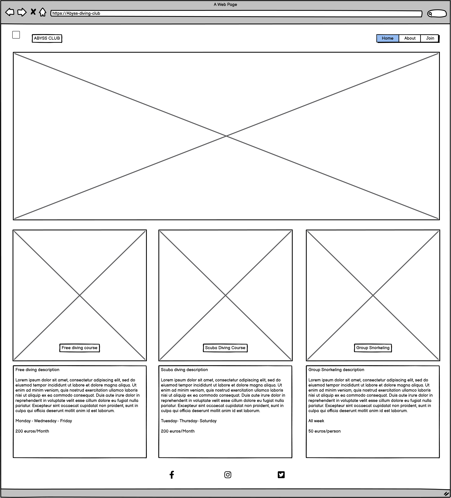

 

About page Wireframes

    

 

Sign Up page Wireframes

    
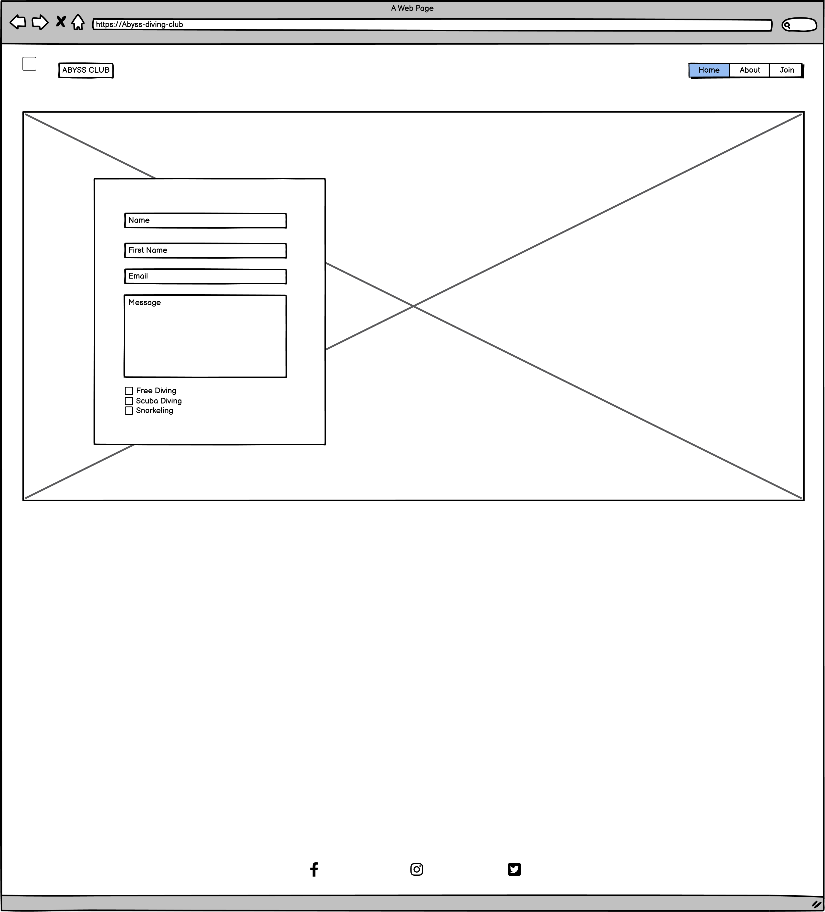

 

[Back to top ⇧](#Abyss-diving-club)

### Design
#### Colour Scheme
The color scheme was generate on [coolors](https://coolors.co/edc9ff-fed4e7-f2b79f-e5b769-d8cc34) using the logo as a starting point. 

Site Logo

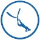

    
The logo colors are white and #1666AF. 

The Generator used `#1666AF` as a reference point and produced this result
    

 

Colour Palette

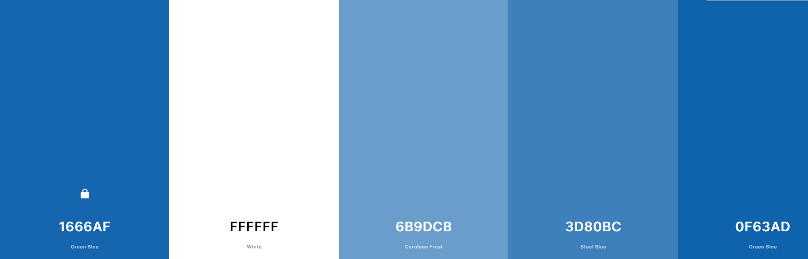

 

Colors where used as such:  
* The backround of the website is completely white. The designer has mmade this choice to keep the website very clean and simple.
* Text in all the website is using the `#1666AF` color to follow the logo color.
* The `#3D80BC` color is used as a Background color for the Join buttons in both the home page and he sign up page
* The `#0F63AD` color is used for the form and for the Footer social links

#### Typography
The developper has chosen Lato and Oswald fron [Google Fonts](https://fonts.google.com/).

Lato was used on the body of the website while Oswald was used on the h1, h2, h3 Titles and in the cover of the hero image.

#### Imagery
The images used on the website are sourced from various websites which are listed in the [Credits section](##Credits) of this README.

[Back to top ⇧](#Abyss-diving-club)

## Features
### Design Features

The Header. the Footer and the Back to Top button are three consistent features in the website. They appear on each page.

- **Header** - The header is a responsive feature that consists of 2 elements: 
    - An anchor containing the logo of the website and the name of the club
    - A navigation menu
The header take the full width of the screen and has an adaptable height depending on the screen size. For clarity purpose and also for a attractiveness, the 2 elements are centered and stack on top of each other on smaller screens. The wanted effect is beauty and also consistency as all sections of the website stack on top of each other whith smaller screens.

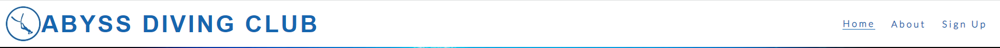

- **Footer** - The footer contains 3 centered social links, takes the full width of any screen and has a fixed height. Again, the purpose of the footer is consistency
in navigation for the user.

- **Back to Top button** - Placed ate the bottom right corner of the screen, it is fixed and does not move with scrolling. The background is transparent to ensure a maximum discretion and minimal interference with the content. The arrow used in the button is surrounded with a dark shadow to make sure the arrow is always visible if it passes over some picture or text. This is once more a developper choice to keep the navigation and the consumption of content as pleasant as possible.

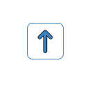

- [The Home Page](https://github.com/LudovicLeGuen/Abyss-Dive-Club/blob/main/index.html)

The home page has two sections:

- **The Hero Image** is all about capting the user attention with a WOW effect (thanks to  the zoom effect) while conveying the purpose of the website in a flash. 

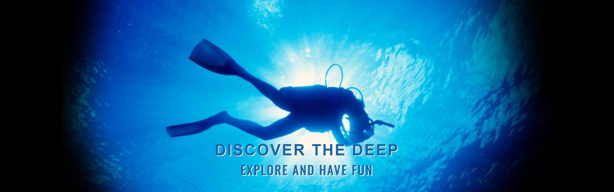
       
- **The 3 Activity sections** describe simply and quickly the most important information for the users and they all have the same structure:
        
    * The title of the activity proposed
    * A picture simply because sometimes a picture is worth a thousand words. This is to make sure the user understand quickly what the website offers.
    * A time/day and duration infromation. 
    * A descprition of the activity written briefly. A small final line in bold characters highlights an important information. 
    * A join button that redirects the users to the sign up page to accelerate and simplify the UX especialy on phones and tablets.
    The 3 Activity boxes are identical in structure, in height and width to keep the website clean and easy to understand. They are centered to help the                   comparaison of information. Under 950 px width, the 3 activity boxes stack on top of each other and still share the same width to keep the website                     consistent.

    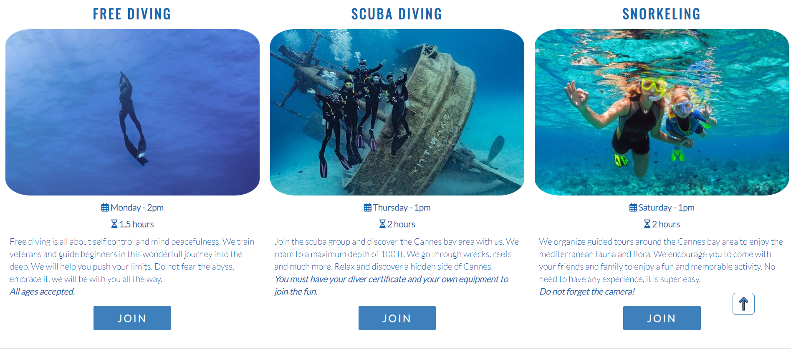
            
- [The about Page](https://github.com/LudovicLeGuen/Abyss-Dive-Club/blob/main/about.html)

The about page has 4 dinstict sections:

- **The Team section** consists of 3 boxes identical in structure representing the leader of each activity. Each boxe contains:
    * The first name of the leader
    * The portrait of the leader
    * A quick bio of the leader to build credibility and therefore trust for the user.
    *The team section is all about credibility and trust. The user needs to feels as secure as possible and showing who deos what is effective. 
    The 3 Team boxes are all indentical in struture, height and width.*

    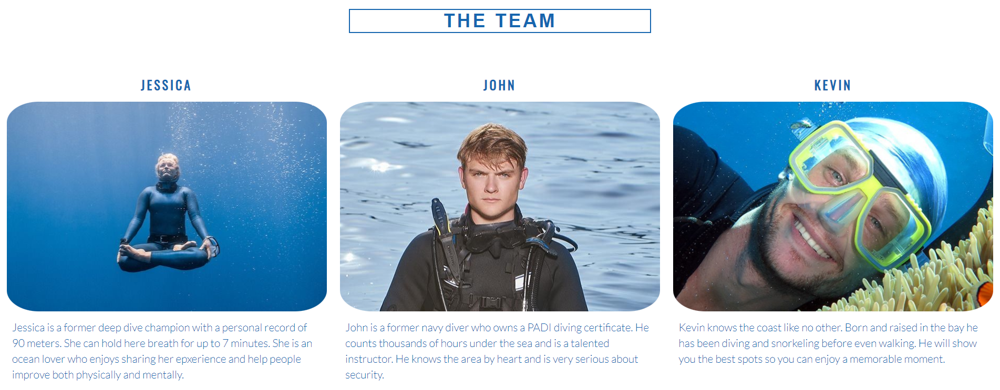
        
- **The "Ethos" section** called "Our Philosophy" are all identical in size and are all centered to keep structural balance. They contain 3 parts:
    * An icon
    * The Ethos name
    * The description
    * The 4 Ethos boxes are meant to deepens the user's trust by exposing the core values of the team.*

    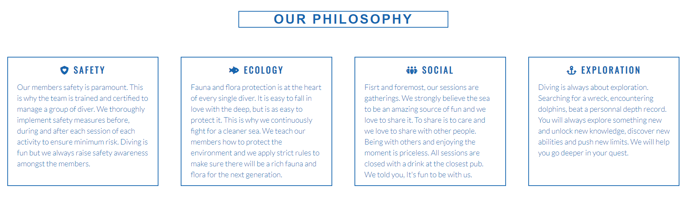
        
- **The video section** purpose is to demonstrtae quickly what the users are going to do. This is meant to help the user make a decision.

    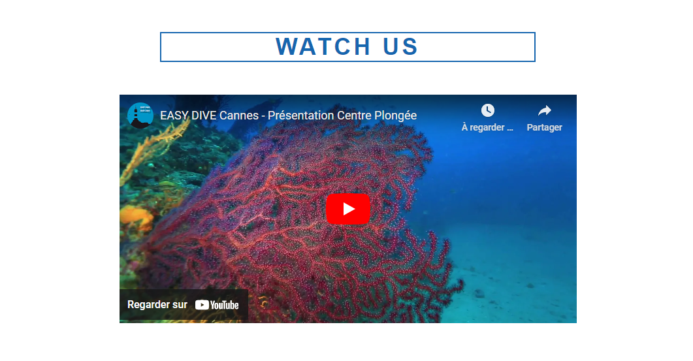
        
- **The Location section**
    The Google map and the picture of the center establish the club as a physical point. This is a powerful psychological tool that prooves the club's existence. 

    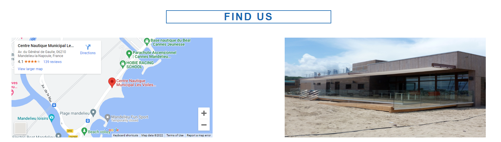

- [The Sign Up Page](https://github.com/LudovicLeGuen/Abyss-Dive-Club/blob/main/sign-up.html)

The sign up page contains two elements:

- **The Sign Up Image** 
    The image has been chosen for its artistic quality simply too illustrate the beauty of diving.

- **The Form**
    The sign up form is pretty simple but its captures the most important user information and allows the user to give more information through amessage box.

    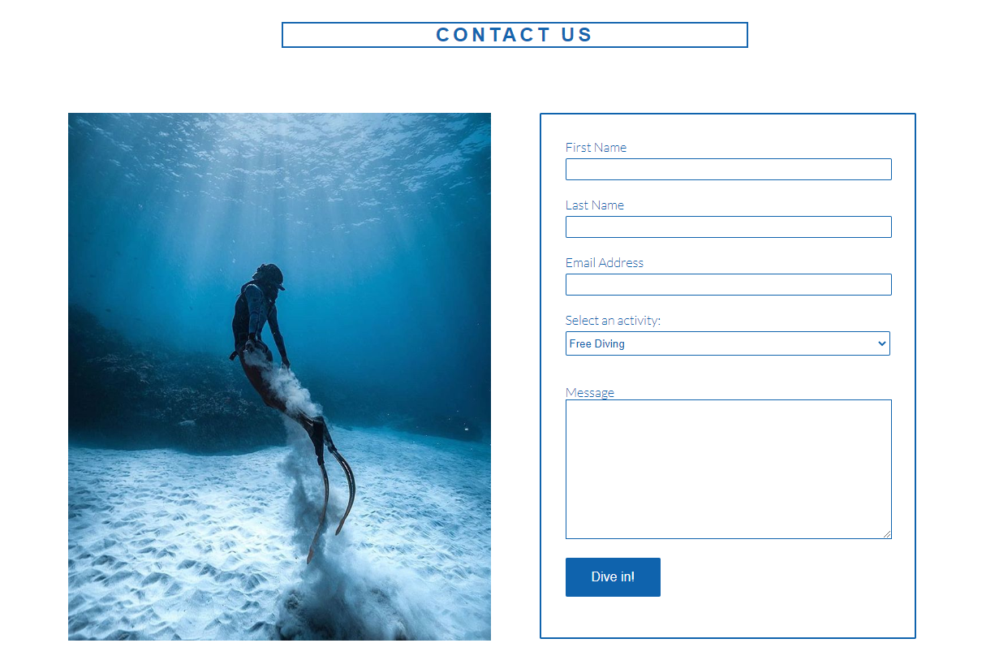

- [The Thank you Page](https://github.com/LudovicLeGuen/Abyss-Dive-Club/blob/main/dump-form.html)

The thank you page contains mainly two elements:

- **The thank you picture** 
    The image has been chosen for its artistic quality simply too illustrate the beauty of diving.

- **The home mutton**
    The button in essence is identical to the Home link in the navigation. Nevertheless, having the button helps the user and make sur the UX is smooth. 

    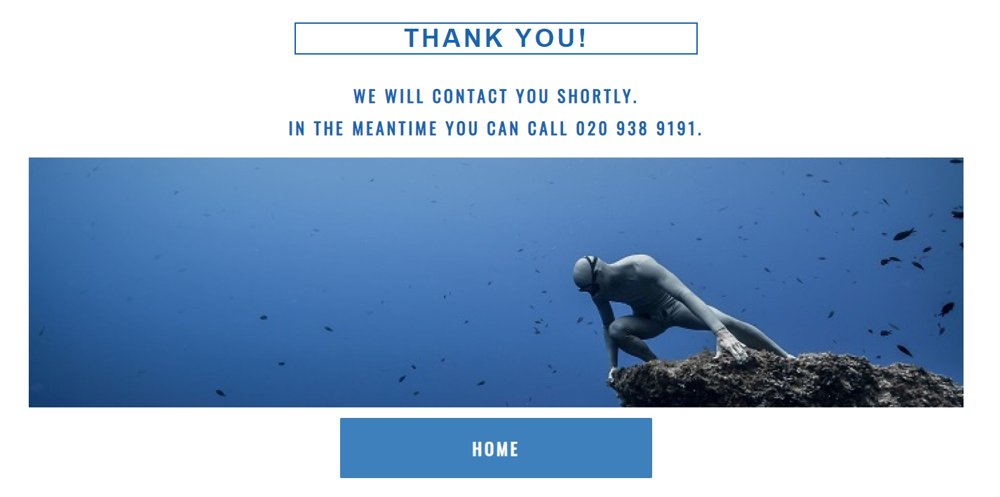

### Existing Features
- **Header** - Found at the top on each page to keep the consistency necessary for clear navigation.
- **Footer** - Found at the bottom of each page still to keep the navigation consistent.
- **Activities** - The 3 activities are described in detail to show the most important information in a flash.
- **Join button** - Found under each activity. Allows the users to reach the noin up page directly withoutthe need to scroll back up (especially ueful on mobile an tablet).
- **Team section** - Provides a quick biography of each activity leader. This is essentially meant to establish the seriousness and credibikity of the team and raise the user confidence.
- **Our Philiosophy section** - Provides the 4 pillars on which each ativity is built upon. Once more, this is a usegul information to built credibility and therefore trust.
- **Youtube video** - The video provides a visual exemple of what is to come. As usual, credibility brings trust
- **Google Map** - The map can help users visualize where to go and also provide a route if the user do not know where is the center.
- **The sign up form** - Is a vital feature to register people and communicate with the team.

### Features to Implement in the future
* Map of the diving sites
     This feature couple be useful to show where people can dive and what they can see. 
* List of necessary equipment
     This feature can help prevent mistakes and provide a useful info for the user. 

[Back to top ⇧](#Abyss-diving-club)

## Issues and Bugs 
Several issues were encountered during developpement but the most troublesome are listed below.

* Checkboxes in Form
The checkboxes in the signup page form prooved to be impossible to fix without Javascript. In effect the checkboxes required to be all ticked for the "Dive In" button (submit button) to work. The issue was not ncessarily problematic since the developper was not allowed to use Javascript but in order to keep the UX as realistic as possible the checkboxes were switched for select elements. 

* Anchor element in the header
The anchor elements in the header contains 1 child elements: an h1 element containing an image element.
The anchor was supposed to be centered horizontally with screens smaller than 950 px but when the text of the h1 element start to superimpose (h1 = ABYSS DIVING CLUB) the anchor sticked to the left of the screen and was no longer centered.
The solution to the issue was given by Ed Bradley by simply adding a flex to the container (the anchor) , seeting a 100% height for the img and setting a font size with a vw value. 

* Back to top button
The back to top button prooved to contain an error in the W3C validator and needed to be modified. A button element was contained in an anchor element. Even though there was no particular bug with the previous back to top button, the developper has decided to still modify it in order to keep a clean validator. 

* Join button in activity boxes
The 3 JOIN buttons of the activity boxes do not align perfectly at certain resolutions.
After multiple attempts and several hours of research, the developper has decided to leave the bug in order to meet the deadline. The bug must be fixed in the next release.  

## Technologies Used
### Main Languages Used
* HTML5
* CSS3
### Frameworks, Libraries & Programs Used
- [Google Fonts](https://fonts.google.com/ "Link to Google Fonts") was used to import the fonts "Lato", and "Oswald".
- [Font Awesome](https://fontawesome.com/ "Link to FontAwesome") was used for the several icons.
- [GitPod](https://gitpod.io/ "Link to GitPod homepage") was used for writing, commiting, and pushing code.
- [GitHub](https://github.com/ "Link to GitHub")
- [Balsamiq](https://balsamiq.com/ "Link to Balsamiq homepage")
- [Am I Responsive?](http://ami.responsivedesign.is/# "Link to Am I Responsive Homepage") was used to verify responsiveness and to create a the top picture of this README.md

[Back to top ⇧](#Abyss-diving-club)

## Testing
Refer to this [page](TESTING.md) please

## Deployment
The site was developped on Gitpod, commiting and pushing to github.

### Deploying on GitHub Pages
To deploy this page to GitHub Pages from its GitHub repository, the following steps were taken:

1. Log into GitHub (or create an account if necessary).
2. Choose the GitHub Repository.
3. Select Settings from the menu items.
4. Select "Pages" from the left hand menu.
5. Under "Branch" click the drop-down menu labelled "None" and select "Main".
6. Click "Save".
7. Wait a few seconds up to a few minutes and refresh the page.
8. The site is now deployed and a link is provided.
    
[Back to top ⇧](#Abyss-diving-club)

## Credits 
### Media
Pictures used on the site come from various websites and belong to several different owners:
* quicksilver-cruises.com
* Pinterest.com
* aquacityfreediving.com
* fairedelavoile.fr
* garmin.com
* padi.com
* checkyeti.com

The video was taken from [youtube](https://www.youtube.com) and belongs to [EASY-DIVE](https://www.youtube.com/watch?v=u9CJtajZ0U0)

### Code 
The developer has consulted countless times Stack Overflow and W3Schools in ordeer to build the website.
The back to top button has been heavily influenced by the website [infopediya.com](https://infopediya.com/back-to-top-button-without-javascript/)
[Back to top ⇧](#Abyss-diving-club)

## Acknowledgements
I would like to thank:
* my wife for her patience and her kind words when I was in doubt.
* my mentor, Seun, for her counseling and her contagious enthusiasm and love for coding.
* my fellow coding students of Code institue who have been invaluable on Slack.

[Back to top ⇧](#Abyss-diving-club)

***

