# Survival Guild - Testing 

[Main README.md file](/README.md)

[View live project](https://ludovicleguen.github.io/Abyss-Dive-Club/)

[View GitHub repository](https://github.com/LudovicLeGuen/Abyss-Dive-Club)

***
## Table of contents
1. [Testing User Stories](#Testing-User-Stories)
2. [Manual Testing](#Manual-Testing)
3. [Automated Testing](#Automated-Testing) 
     - [Code Validation](#Code-Validation)
     - [Browser Validation](#Browser-Validation)
4. [User Testing](#User-Testing)

***

## Testing User Stories
#### Frequent User Goals:
#### New User Goals:

## Manual Testing
### Navigation bar, Footer, Back to Top button
* The logo and site name go back to the home page
* The Navigation menu links open the correct pages
* Hovering over the navigation links underline them to show users they are clickable
* Pages links are underlined when the user is browsing the page.

* The footer links open in a new tab
     * Facebook
     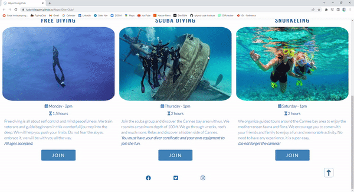

     * Twitter 
     

     * Instagram 
        

* The back to the top button redirects to the navigation bar.
 

### Home Page
* The hero image animation works when the page is refreshed
     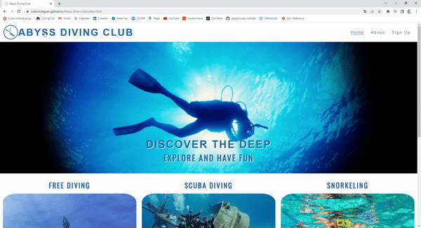 

* The join button of each activity redirects to the signup page and hovering over them  changes their colors
 

### About Page
* The location map iFrame is fully functional 

* The Youtube video embedded is fully functional 
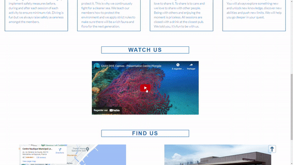

### Sign-up Page
* Each field is required to send the form (except the dropdown menu)
* The form sends the data correctly. 
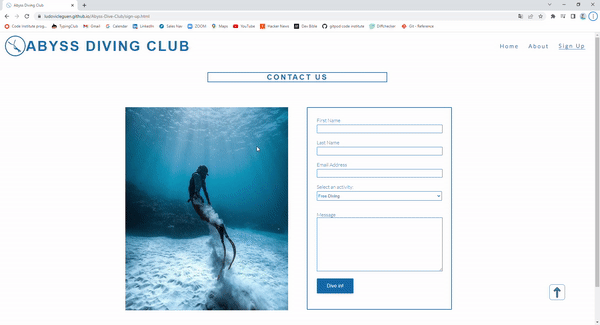

## Automated Testing
### Code Validation
* Home page W3C code validation 

* About page W3C code validation 
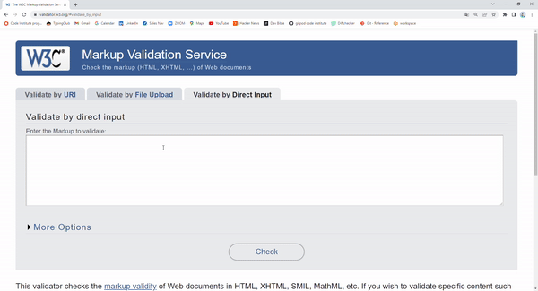

* Sign-up page W3C code validation 
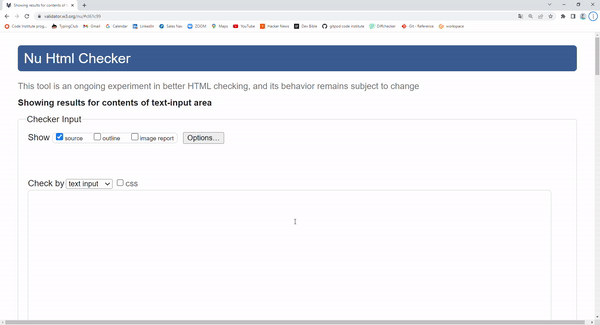

* CSS W3C code validation 
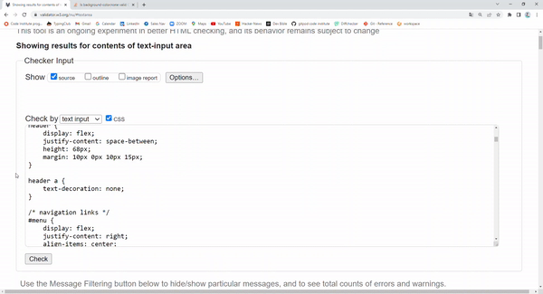

### Browser Validation
* Chrome 
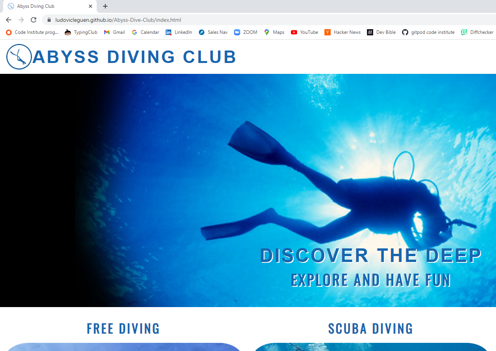

* Firefox 
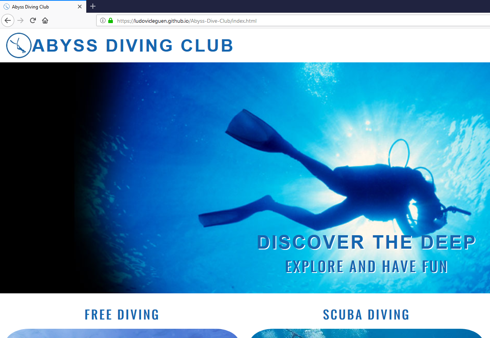

* Opera 
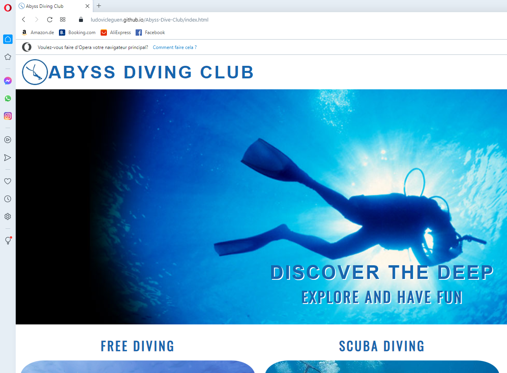

* Edge 
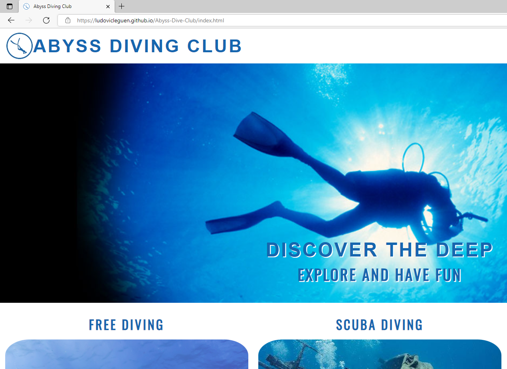

## User testing 
My wife and fellow coders at Code Institute participated in the tests. Special thanks to Kevin Bergström, Niclas Tanskanen, Folarin Ogungbemi and Matthias Kiesel for their feedback and ideas to improve my website.

***