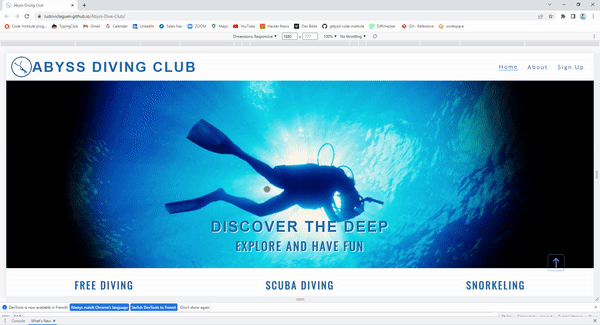
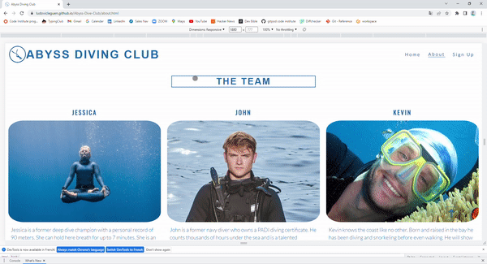
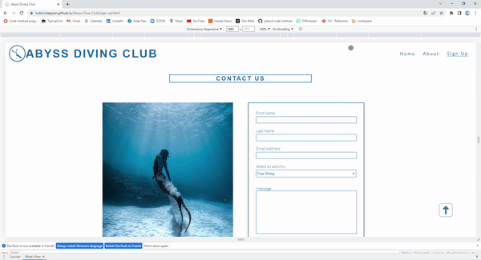
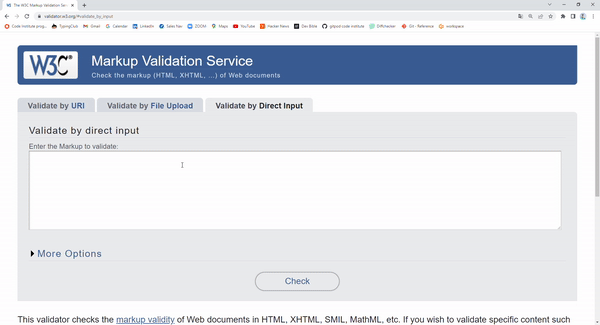
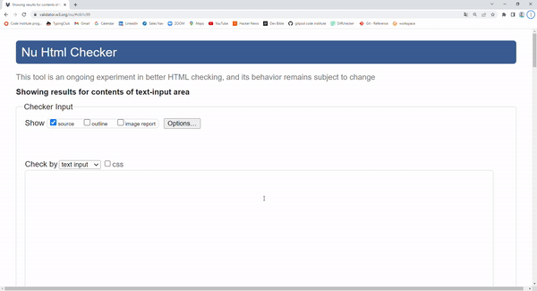
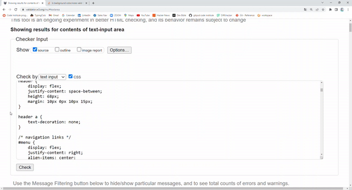
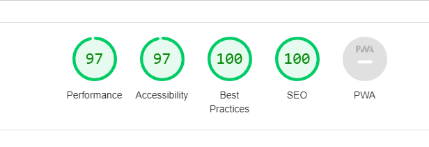
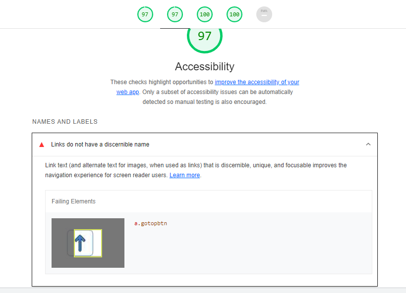

# Abyss diving club - Testing 

[Main README.md file](/README.md)

[View live project](https://ludovicleguen.github.io/Abyss-Dive-Club/)

[View GitHub repository](https://github.com/LudovicLeGuen/Abyss-Dive-Club)

***
## Table of contents
1. [Testing User Stories](#Testing-User-Stories)
2. [Manual Testing](#Manual-Testing)
3. [Automated Testing](#Automated-Testing) 
     - [Code Validation](#Code-Validation)
     - [Browser Validation](#Browser-Validation)
4. [User Testing](#User-Testing)

***

## Testing User Stories
#### Frequent User Goals:
* As a frequent user, I want to see a pleasing website representing a group of people to which I am proud to be part of.
     * The website has a clear color palette that fits the theme throughout the website.
     * The sections are clean and organized harmoniously and the pages are therefore well connected.
     * The picture used are well chosen so that they appear professional and even artictic in some cases in order to give a professional feel to the group.

* As a frequent user, I want a website easy to navigate with information easily readable and accessible.
     * The information in the website are concise and clearly labeled.
     * The use of join buttons within the home page improve the uX and help the users with the navigation.
     
* As a frequent user, I want to access the content with minimum clicks.
     * All pages are accessible through a single click and minimum scrolling.

#### New User Goals:
* As a new user, I want to navigate the site easily and intuitively.
     * The design of the pages and the labelling in particular allow for an easy navigation even for a newcomer.
     * The use of join buttons within the home page improve the uX and help the users with the navigation.

* As a new user, I want relevant information organized in graphically logical manner.
     * The harmonious use of colours and the consistent use of identical boxes to describe the content shows the content logically.
     * The constant labeling of the section of each page helps the logical path of the user

* As a new user, I want to understand what the website is about within a few seconds.
     * The hero image animation catch the attention of the user.
     * The organisation of the landing page with 3 identical boxes containing the key informations shows the most important information about the site.

[Back to top](#Abyss-diving-club---Testing)
## Manual Testing
### Navigation bar, Footer, Back to Top button
* The logo and site name go back to the home page
* The Navigation menu links open the correct pages
* Hovering over the navigation links underline them to show users they are clickable
* Pages links are underlined when the user is browsing the page.

* The footer links open in a new tab
     * Facebook 

     
 
     * Twitter  

     

     * Instagram  

        

* The back to the top button redirects to the navigation bar.
 

[Back to top](#Abyss-diving-club---Testing)
### Home Page
* The hero image animation works when the page is refreshed

      

* The join button of each activity redirects to the signup page and hovering over them  changes their colors

 

### About Page
* The location map iFrame is fully functional 

* The Youtube video embedded is fully functional 

### Sign-up Page
* Each field is required to send the form (except the dropdown menu)
* The form sends the data correctly. 

### Responsiveness
* Home page

* About page 

* Sign-up page

[Back to top](#Abyss-diving-club---Testing)

## Automated Testing
### Code Validation
* Home page W3C code validation 

* About page W3C code validation 

* Sign-up page W3C code validation 

* CSS W3C code validation 

* LightHouse validation 

### Browser Validation
* Chrome 

* Firefox 

* Opera 

* Edge 

[Back to top](#Abyss-diving-club---Testing)

## User testing 
My wife and fellow coders at Code Institute participated in the tests. Special thanks to Kevin Bergström, Niclas Tanskanen, Folarin Ogungbemi and Matthias Kiesel for their feedback and ideas to improve my website.

***